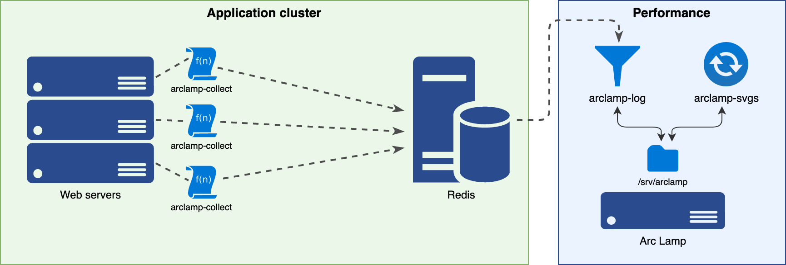

# Arc Lamp

Arc Lamp helps gather stack traces from a running PHP 7 application
and publish them in the form of flame graphs and trace logs.
See [performance.wikimedia.org](https://performance.wikimedia.org/php-profiling/) for a live example.

## Prerequisites

* Your PHP application, with [php-excimer](https://github.com/wikimedia/php-excimer) and php-redis.
* A Redis server.
* Python, with python-redis and python-yaml.

## Quick start

```php
require_once 'ArcLamp.php';

Wikimedia\ArcLamp::collect( [ 'redis-host' => '127.0.0.1' ] );
```

To automatically enable this for all web requests and entry points, you can use the PHP
[`auto_prepend_file`](https://www.php.net/manual/en/ini.core.php#ini.auto-prepend-file)
option. See [Wikimedia's own configuration](https://github.com/wikimedia/operations-mediawiki-config/blob/de23fd42e09b4140c37b6836c2d8057d439110ad/wmf-config/PhpAutoPrepend.php#L5) for example.

## How it works



The Arc Lamp pipeline comprises of three stages:

1. Capture stack traces.
2. Create trace logs.
3. Generate flame graphs.

### Capture stack traces

The [php-excimer](https://github.com/wikimedia/php-excimer) extension is used to periodically
collect a backtrace. It has no run-time overhead by default. When enabled from a web request,
it periodically schedules a graceful interrupt at which point it captures a backtrace.

These traces can be collected from a PHP callback and dispatched to a socket or file as-needed.

The default in `ArcLamp.php` is to send the trace to a Redis pubsub channel.

> _Arc Lamp was originally created in 2015 for [Xenon](https://github.com/facebook/hhvm/wiki/Profiling#xenon), a sampling profiler native to the HHVM engine for PHP. To use Arc Lamp with HHVM Xenon, see [arc-lamp v1.0](https://gerrit.wikimedia.org/g/performance/arc-lamp/+/1.0.0/) instead._

### Create trace logs

In Wikimedia's production cluster, Arc Lamp's Redis server resides in the high availability "Tier 1"
zone, and thus kept separate from offline performance, research, and statistics services ("Tier 2").

Each of the production web servers uses the `ArcLamp::collect` client in PHP to send traces to Redis.

The `arclamp-log` service subscribes to the Redis pubsub channel, normalizes the stack traces and
write them to the relevant trace log files. The [example configuration](./arclamp-log.yaml) creates
a trace log file for each hour and each day.

Within those two time periods, it segregates the trace logs by entry point of the PHP application.

For example, the MediaWiki application has `index.php`, and `rest.php` (web) and `RunJobs.php` (CLI)
entry points. This results in the following trace logs:

* `daily/2019-12-21.all.log`
* `daily/2019-12-21.index.log`
* `daily/2019-12-21.rest.log`
* `daily/2019-12-21.RunJobs.log`
* …
* `hourly/2019-12-21_20.all.log`
* `hourly/2019-12-21_20.index.log`
* `hourly/2019-12-21_20.rest.log`
* `hourly/2019-12-21_20.RunJobs.log`
* …

The `arclamp-log` service is also responsible for pruning trace logs older than the configured
retention period.

### Generate flame graphs

The `arclamp-generate-svgs` script runs at a regular interval and creates or updates the flame graph
associated with each trace log file. It also maintains a _reverse_ version of each flame graph.

For example:

* `daily/2019-12-21.all.svgz`
* `daily/2019-12-21.all.reversed.svgz`
* `daily/2019-12-21.index.svgz`
* `daily/2019-12-21.index.reversed.svgz`
* …
* `hourly/2019-12-21_20.all.svgz`
* `hourly/2019-12-21_20.all.reversed.svgz`
* `hourly/2019-12-21_20.index.svgz`
* `hourly/2019-12-21_20.index.reversed.svgz`
* …

The `arclamp-generate-svgs` script also removes graphs for which a trace log no longer exists.

## Demo

See [performance.wikimedia.org](https://performance.wikimedia.org/php-profiling/) for a live example.
